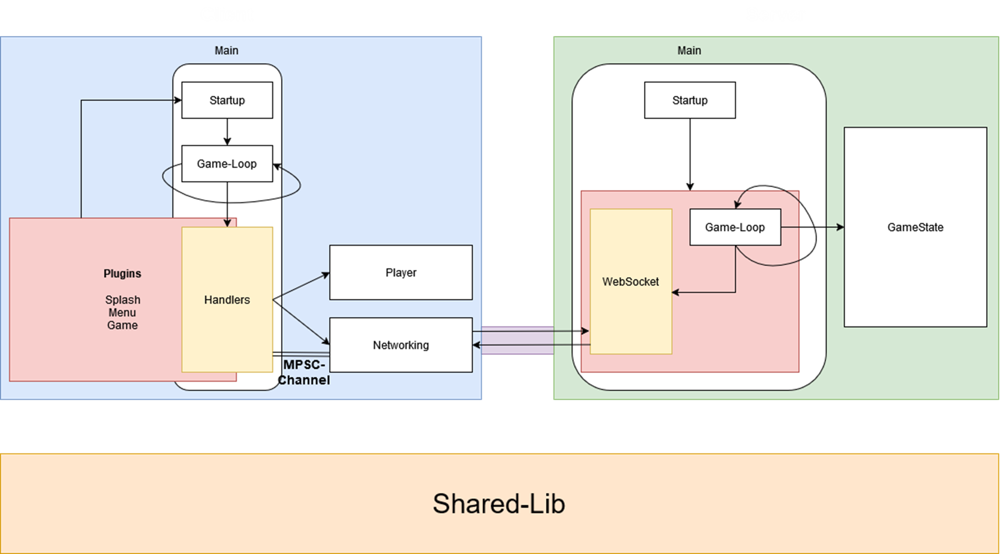

# DataDrift 🕹️⚡

DataDrift is a real-time multiplayer racing game where you control a high-speed data packet zooming through cyberspace. Inspired by classic games like Curve Fever, you must outmaneuver opponents, avoid digital firewalls, and survive the chaotic network traffic!

This is my first time ever trying to implement a game with network-features that are needed to update the game-state itself. The implementation can be a little bit messy at some places but the focus was not on the most cleanest solution possible. It was rather on trying how a game can communicate a game-state in an efficient way.

## Tech-Stack

- Rust
- Bevy
- WebSockets

## Prerequisites

When trying to build the game by yourself make sure to have the Bevy Dependencies installed:
https://bevyengine.org/learn/quick-start/getting-started/setup/#rust-setup

### How to run it

This repository holds the Game-Client, as well as the Backend and a lib for shared-models. Upon Startup the game will try to connect to the backend immediately and will not move on from the splash-screen until a connection to the backend was established. Therefore the right IP-Address needs to be set in the main.rs of the client. Localhost is used as the default IP-address. If you are connected, you can press Play and the game starts immediately. This only makes sense when there are multiple players connected. (For testing-purposes a second player can simply be connected via Postman, etc...).

### Architecture

#### ToDos

I am aiming to further develop this game a little bit and a few things i want to do are:

- Improve some graphical elements in the game
- Use a partitioning-algorithm to improve collision-detection for larger scale
- Implement a lobby-system (so game doesn't only run on a single lobby)
- New Game-Features like Power-ups
